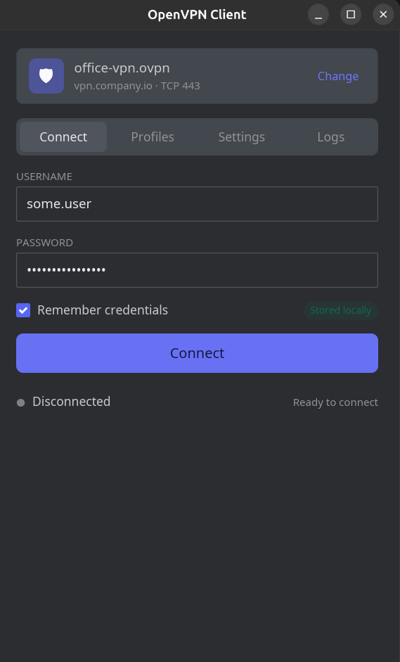
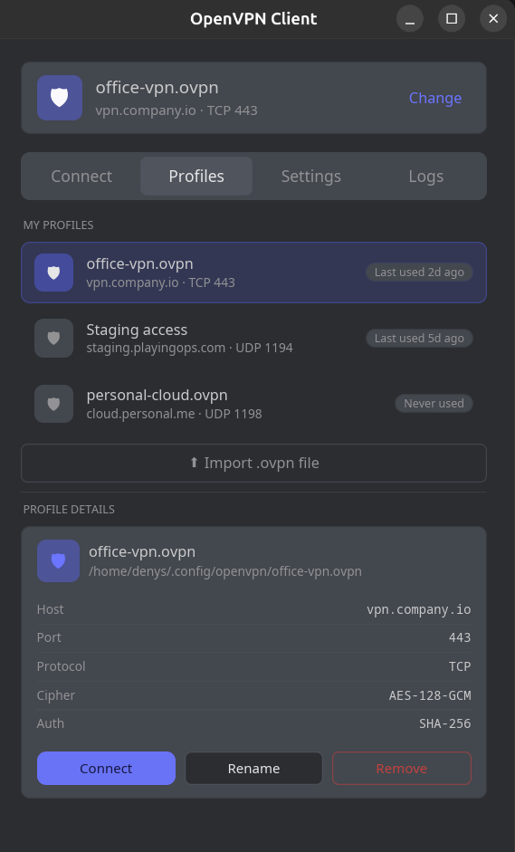
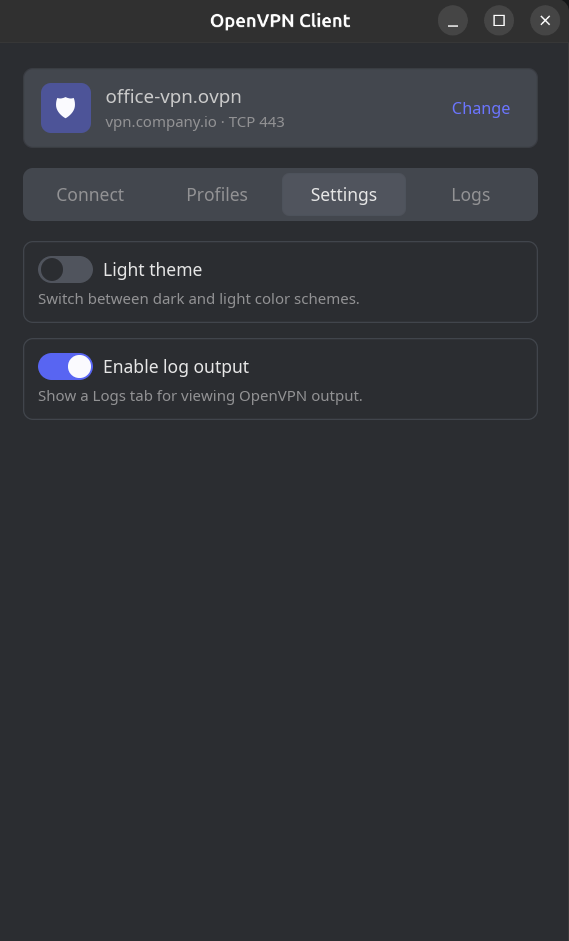

<div align="center">

# OpenVPN GUI for Linux

A simple, native desktop GUI for managing OpenVPN connections on Linux.

[](https://www.rust-lang.org/)
[](https://iced.rs/)
[](#license)
[](#)

</div>

---

## Overview

`openvpn-gui-linux` is a lightweight graphical front-end for the OpenVPN client, written in Rust using the [Iced](https://iced.rs/) toolkit. It wraps the standard `openvpn` CLI via its management interface and provides a clean, modern UI for connecting to, monitoring, and troubleshooting VPN sessions.

## Features

- **One-click connect / disconnect** to any `.ovpn` profile
- **Configuration picker** — browse and load profiles from disk
- **Live connection status** and real-time log stream
- **Username / password and static-challenge** authentication flows
- **Inline certificates** (`<ca>`, `<cert>`, `<key>`, `<tls-auth>`) supported
- **Persistent settings** stored in your user config directory
- **Native, dependency-light UI** — no Electron, no web stack

## Screenshots

<p align="center">
  
  
  
</p>

<p align="center">
  <sub>Connect · Profiles · Settings</sub>
</p>

## Requirements

- Linux (tested on Ubuntu / Debian-family distros)
- [`openvpn`](https://openvpn.net/) installed and available on `PATH`
- Rust toolchain **1.85+** (edition 2024)
- `pkexec` / `sudo` for elevated privileges when bringing interfaces up

Install OpenVPN on Debian/Ubuntu:

```bash
sudo apt install openvpn
```

## Installation

Pick whichever matches your distro. All artifacts depend on `openvpn` being
installed on the host.

### Debian / Ubuntu

```bash
sudo apt install ./openvpn-gui-linux_<version>_amd64.deb
```

### Fedora / RHEL / openSUSE

```bash
sudo dnf install ./openvpn-gui-linux-<version>-1.x86_64.rpm
```

### Any Linux (portable tarball)

```bash
tar xzf openvpn-gui-linux-<version>-x86_64.tar.gz
cd openvpn-gui-linux-<version>-x86_64
sudo ./install.sh              # installs to /usr/local, override with PREFIX=~/.local
```

### Build from source

```bash
git clone git@github.com:DenysFizer/openvpn-gui-linux.git
cd openvpn-gui-linux
cargo run --release
```

The compiled binary will be at `target/release/openvpn-gui-linux`.

### Building the release artifacts yourself

```bash
cargo install cargo-deb cargo-generate-rpm   # one-time
./scripts/package.sh                          # outputs to dist/
```

See [`packaging/README.md`](packaging/README.md) for details.

## Usage

1. Launch the app.
2. Click **Load Config** and pick your `.ovpn` file.
3. Enter credentials if the profile requires them.
4. Press **Connect** — status and logs stream live in the main view.
5. **Disconnect** cleanly tears down the session.

## Project Layout

```
src/
├── app.rs           # Iced application entry point & state
├── config/          # .ovpn parser and configuration model
├── openvpn/         # Process manager + management-interface client
├── ui/              # Views: connect, logs, status bar
├── settings.rs      # Persisted user preferences
├── error.rs         # Unified error types
└── main.rs
tests/
└── fixtures/        # Sample .ovpn files for parser tests
```

## Development

```bash
cargo check          # fast type-check
cargo test           # run unit & integration tests
cargo clippy         # lints
cargo fmt            # format
```

## Roadmap

- [ ] System tray integration
- [ ] Multiple simultaneous profiles
- [ ] Flatpak / AppImage packaging
- [ ] Arch Linux AUR package
- [ ] Dark/light theme toggle
- [ ] Per-profile auto-connect

## Contributing

Issues and pull requests are welcome. For substantial changes, please open an issue first to discuss the direction.

## License

MIT © Denys Fizer
